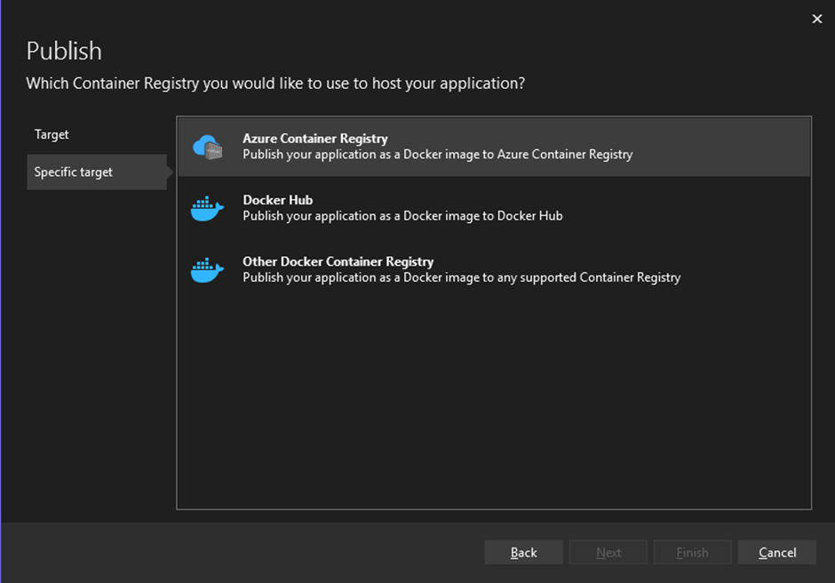

# EventHubDataMover

An application to migrate data from one eventhub to another in real time and deployed to AKS

# Once the .NET Application is setup:

### Publish the app

- Right click on the app and select publish

---

## 

---

### Send the app to ACR(without making use of docker)

- After selecting publish create a new profile in order to **push to ACR**
- Select the Second option, i.e, **Docker Container Registry**
  
- And then proceed to choose **Azure Container Registry**.
  
- Which automatically searches, the Azure account linked with microsoft account signed in, for any registry instances and brings it up.
- Select the required registry and proceed to choose the .NET SDK build and not the docker desktop option.
  
  

---

### Publishing the App

- Once the profile has been created the App can be published(it does take a while the first time because of the inital build process)
  
- And the image is now uploaded onto ACR with a name same as your project name.

---

### Deploying the App onto AKS

- Now as I dont have access to an RBAC token. I deployed the application to AKS locally by making use of kubectl and a app-deployment.yaml file. [The file](./app-deployment.yaml)

```bash
apiVersion: apps/v1
kind: Deployment
metadata:
  name: eventhubdatamover
spec:
  replicas: 1
  selector:
    matchLabels:
      app: eventhubdatamover
  template:
    metadata:
      labels:
        app: eventhubdatamover
    spec:
      containers:
      - name: eventhubdatamover
        image: ACRcrg.azurecr.io/eventhubdatamover:latest
        ports:
        - containerPort: 80
        imagePullPolicy: Always
---
apiVersion: v1
kind: Service
metadata:
  name: my-app-service
spec:
  type: LoadBalancer
  selector:
    app: eventhubdatamover
  ports:
    - protocol: TCP
      port: 80
      targetPort: 80

```

- In order to deploy the app by making use of above created yaml we can use the following commands

```bash
kubectl apply -f app-deployment.yaml
kubectl get deployments
kubectl get pods
kubectl get service my-app-service(or whatever depending on your app-deployment.yaml)
```

---

### Checking the logs

- We can obtain the logs of the deployed application in two ways. Either the **cli** or ny using the **gui/website**.

- In order to check the logs via the cli

```bash
kubectl logs <podname>
```

- In order to view the logs on the GUI:
  - Head on to the portal
  - Go to your Kubernetes Service
  - Monitoring -> Insights -> Controllers -> Select the application you deployed
    

---

### For maintaing sync 
- Now whenever a change occurs we would usually trigger/activate a pipeline
- That would rebuild the image and maintain sync with AKS
- But in this case without an RBAC a pipeline cannot be maintainer
- But for kubectl we can use the below command which pulls the latest image it can find from the ACR

```bash
kubectl rollout restart deployment eventhubdatamover
```

---
